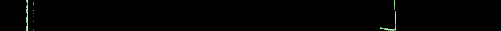
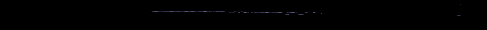
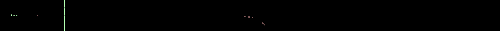
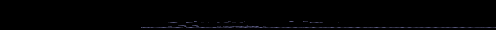

# Model Evaluation Results

## Important note:
I discovered that one of the masks in the test set is broken  
(doesn't contain a mask with defects, but the model could successfully recognize a defect)  
So I had to do a manual analysis  
  
Data splits are shown in `data_splits.txt`

## Error codes encoding (as in yaml config and onnx model):
* 002 - Broken end  - Red
* 006 - Broken yarn - Green
* 010 - Broken pick - Blue

## Validation Set

### Image 0089_002_01

**Original Image**

**Ground Truth Mask**

**Predicted Visualization**

Result: successfully predicted the correct defect type

---

### Image 0016_006_02

**Original Image**

**Ground Truth Mask**

**Predicted Visualization**

Result: successfully predicted the correct defect type

---

### Image 0105_010_03

**Original Image**

**Ground Truth Mask**

**Predicted Visualization**

Result: successfully predicted the correct defect type

### Validation Accuracy: 100% all defects were correctly recognized and assigned correct defect types

---

## Test Set

### Image 0090_002_01

**Original Image**

**Ground Truth Mask**

**Predicted Visualization**

Result: couldn't detect the defect

---

### Image 0081_006_04

**Original Image**

**Ground Truth Mask**

**Predicted Visualization**

Result: successfully predicted the correct defect type

---

### Image 0106_010_03

**Original Image**

**Ground Truth Mask**

**Predicted Visualization**

Result: successfully predicted the correct defect type

### Test Accuracy: 66% (2 defects out of 3 were correctly recognized)

### P.S.
Got lucky that the last sample didn't go to the training set :)  
It also means - there was no data leakage to the train set cuz it'd be obvious  
This broken mask is technically an example of the data poisoning attack.